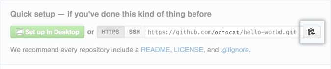
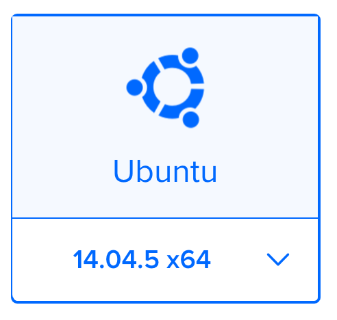
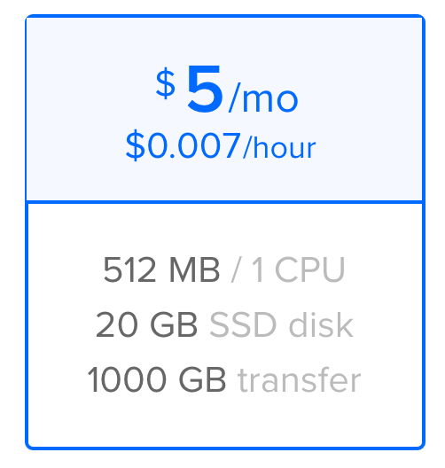
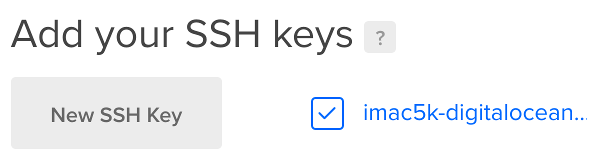

# Deploying a Blog with Jekyll, Gearship, Github, Docker Cloud/Hub, and DigitalOcean

Let's walk through how to do a deployment of a jekyll blog.

### First make sure you have jekyll and gearship installed globally.
```
gem install jekyll
gem install gearship
```

## Create a new app

Create a jekyll blog and go to the folder

```
jekyll new gearship-example-blog
cd gearship-example-blog
```

## Create a new Dockerfile in the project root with the system we want docker to configure for our project.
```
FROM leonas/ubuntu:latest
MAINTAINER Leonas <leonas@leonas.io>

# Install all the dependencies for Jekyll
RUN apk-install bash build-base git libffi-dev zlib-dev libxml2-dev libxslt-dev ruby ruby-dev nodejs

# Install Jekyll
RUN gem install bundler jekyll --no-ri --no-rdoc

# Install nokogiri separately because it's special
RUN gem install nokogiri -v 1.6.7.2 -- --use-system-libraries

# Copy the Gemfile and Gemfile.lock into the image and run bundle install in a
# way that will be cached
WORKDIR /tmp
ADD Gemfile Gemfile
ADD Gemfile.lock Gemfile.lock
RUN bundle install

# Copy source
RUN mkdir -p /src
VOLUME ["/src"]
WORKDIR /src
ADD . /src

# Jekyll runs on port 4000 by default
EXPOSE 4000

# Run jekyll serve
CMD ["./jekyll-serve.sh"]
```

## Create a jekyll_serve.sh file

```
#!/bin/bash

set -e

bundle exec jekyll serve --drafts --incremental --host 0.0.0.0
```

## Create a Github repository for the project

- Go to [github/new] and create a new repo.
- Copy the remote repository url from the next page.


Use a GUI like GitKraken or the terminal to create the new repo:
```bash
$ git init
$ git add
$ git commit -m "First commit"
$ git remote add origin [paste the copied url]
$ git push origin master
```

## Create a Docker Cloud automated build repository

- Go to [Docker Cloud] and create a new repository
- Name the repository the same name as on Github
- Link the Github repo in Build Settings

## Create a droplet on DigitalOcean







Take note of the IP. 

## Initialize Gearship

```
gearship init
```

## Setup Gearship
Edit gearship.yml


## Push to Github to trigger build
```
git push origin master
```

## Deploy To Server
Once docker [Docker Cloud] reports that the build was successful you can deploy to your 
droplet using
```
gearship deploy 138.68.7.15 
```

[github/new]: https://github.com/new
[Docker Cloud]: https://cloud.docker.com
